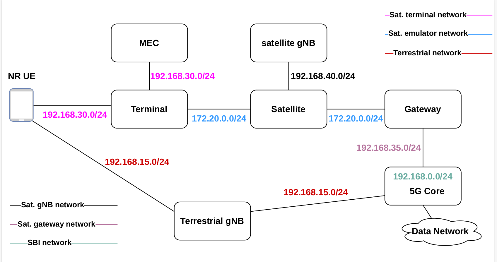

# 3D-NTN
This repo is intended for deploying a Resilient 5G Non-terrestrial 3D Network by using Free5GC as a 5G core, OpenSand as a satellite emulator, and UERANSIM as a radio access emulator. All the components are deployed in a docker-compose environment as docker containers.

### Free5GC core
* Emulate a 5G core network by building components in a distributed way with Service Based Interface (SBI) subnet 192.168.0.0/24.
* All the 5G core components can be built executing the shell file **build_core.sh** in the directory **/home/vagrant/3D-NTN/build_images/build_core.sh**. 
* For registering the user equipment into the MongoDB database, we used a container that registers UE directly into the database without using WebUI for simplicity.

### OpenSand emulator
* The OpenSand satellite emulator consists of three components, **Satellite**, **Gateway**, and **Terminal**.
* These components are built as a docker container from the directory, **/home/vagrant/3D-NTN/build_images/opensand-simulator/opensand**.

### UERANSIM 
Is used to build docker images for gNB and UE. Running a shell file **build_ran.sh** in the directory **/home/vagrant/3D-NTN/build_images/build_ran.sh** will build the gNB and UE.

### Instructions

Clone repository in an environment where docker and docker-compose are pre-installed.

Build the docker images:

```
For 5G core
cd /home/vagrant/3D-NTN/build_images
./build_core.sh
```
```
For OpenSand
cd /home/vagrant/3D-NTN/build_images/opensand-simulator/opensand
From this directory, all the components are built when running the docker-composeSat.yaml file.
```
```
For UERANSIM
cd /home/vagrant/3D-NTN/build_images
./build_ran.sh
```
The deployed network topology is shown below below:

</img>

### Before executing the network after building the images,
* Install GTP5G for the Free5GC UPF to enable the GPRS Tunnelling for a 5G-based network. Run the file **./installgtp5g.sh**
* Install Docker and docker-compose

### Run experiments

* To install 


